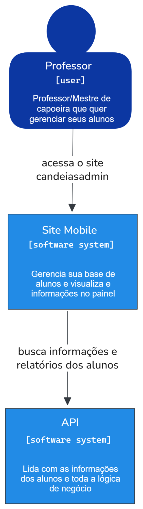

---

theme: "white"
transition: "slide"
title: "CandeiasAdmin: Sistema de Gestão de Praticantes de Capoeira do Grupo Candeias no Acre"
enableMenu: true
enableSearch: false
enableChalkboard: true
slideNumber: true

---

### CandeiasAdmin

Sistema de Gestão de Praticantes de Capoeira do Grupo Candeias no Acre

---

### CandeiasAdmin

Luís Antônio Lima Santiago & Ezequiel da Silva Soares

Orientador: Prof. Dr. Marlon Coelho Teixeira

---

### Problema

Quantos alunos você tem?

---

### Problema

* Ausência de plataformas para **centralizar informações** sobre praticantes.
* Dados dispersos: memória oral, anotações físicas e planilhas manuais.
* Dificuldade de mensurar o número de praticantes.
* Prejuízo à **gestão pedagógica e cultural** do grupo.

---

### Impacto Cultural

* **Patrimônio Imaterial** reconhecido pelo IPHAN (2008) e pela UNESCO (2014).
* Expressão da **resistência negra** e símbolo da identidade nacional.
* Importante instrumento de **inclusão social e educacional**.
* Conecta **escolas, comunidades e gerações.**

---

### Objetivo

Desenvolver o **CandeiasAdmin**, um sistema de gestão digital para o Grupo Candeias de Capoeira do Acre

---

### Fundamentação Teórica

---

### Fundamentação Teórica

  <ol>
    <li>Escola e Cultura</li>
  </ol>

---

### Fundamentação Teórica

  <ol>
    <li>Escola e Cultura</li>
    <li>Capoeira como método pedagógico</li>
  </ol>

---

### Fundamentação Teórica

  <ol>
    <li>Escola e Cultura</li>
    <li>Capoeira como método pedagógico</li>
    <li>Grupo Candeias de Capoeira</li>
  </ol>

---

### Fundamentação Teórica

  <ol>
    <li>Escola e Cultura</li>
    <li>Capoeira como método pedagógico</li>
    <li>Grupo Candeias de Capoeira</li>
    <li>Dados sobre a capoeira</li>
  </ol>

---

### Fundamentação Teórica

  <ol>
    <li>Escola e Cultura</li>
    <li>Capoeira como método pedagógico</li>
    <li>Grupo Candeias de Capoeira</li>
    <li>Dados sobre a capoeira</li>
    <li>Desafios para a digitalização da capoeira</li>
  </ol>

---

### Motivação para o Sistema

> “a produção acadêmica e científica sobre a capoeira no Brasil contemporâneo encontra-se fragmentada.”
> *(IPHAN, 2007, p. 95)*

---

### Requisitos do Sistema

---

### Requisitos Funcionais (RF)

* RF1: Login com conta Google (OAuth2)
* RF2: Painel de indicadores
* RF3–RF4: Cadastro de alunos (menores e adultos)
* RF5–RF7: Listar, acessar e editar fichas
* RF9–RF10: Promover e revogar professores
* RF11-12: Associar graduação e CT a um aluno
* RF13–RF14: Gerar e acessar links de autocadastro

---

### Requisitos Não Funcionais (RNF)

* RNF1: Usabilidade e layout intuitivo
* RNF2: Desempenho em grandes bases
* RNF3: Acessibilidade (HTML semântico, contraste)
* RNF4: Documentação
* RNF5: Código modular e de fácil manutenção

---

### Arquitetura do Sistema

Baseada no modelo **Cliente-Servidor**, composta por:

* **Frontend**: Next.js (React)
* **Backend**: Node.js + Express
* **Banco de Dados**: PostgreSQL
* **Autenticação**: JWT + OAuth2
* **Containerização**: Docker

---

### Diagrama de Sistema (C4 – Nível 1)

---

{width=18%}

---

### Diagrama de Container (C4 – Nível 2)

---

{width=45%}

---

### Tecnologias Utilizadas

* 🟦 **Next.js (React)** – Criação de interfaces dinâmicas e responsivas.
* 🟢 **Node.js + Express** – Servidor rápido e modular.
* 🐘 **PostgreSQL** – Armazenamento relacional dos dados.
* 🐳 **Docker** – Padronização de ambientes.
* 🔐 **JWT + OAuth2** – Autenticação segura.
* 🧪 **Jest** – Testes automatizados de integração e unidade.

---

### Infraestrutura e Segurança

* **Docker**: garante portabilidade e reprodutibilidade.
* **JWT**: autenticação segura entre cliente e servidor.
* **OAuth2**: login via conta Google, simplificando o acesso de mestres e professores.

---

### Banco de Dados

Modelo relacional utilizando **chaves primárias e estrangeiras**, garantindo integridade e eficiência.

---

### Backend – API REST

Implementada com **Express + TypeScript**, fornece endpoints para:

* Cadastro, edição, exclusão e listagem de alunos e professores.
* Consultas agregadas para o painel de indicadores.
* Geração de tokens de autenticação (JWT).

---

### Frontend – Next.js

Interface web moderna, com design limpo e responsivo.

* Dashboard com indicadores visuais.
* Formulários acessíveis e adaptados para dispositivos móveis.
* Uso de gráficos para representar distribuição por idade, gênero e graduação.

---

### Testes Automatizados

Implementados com **Jest**, cobrindo cenários de sucesso e falha.

---

### Fluxos da Aplicação

1. Login via Google.
2. Painel do professor com estatísticas.
3. Cadastro de alunos.
4. Edição e exclusão de fichas.
5. Geração de link de autocadastro.
6. Promoção de alunos a professores.

---

### RESULTADOS E DISCUSSÃO

---

### Painel de Indicadores

Permite análise estratégica dos praticantes:

* Total de alunos e novos alunos.
* Alunos com título "graduado" ou acima.
* Distribuição por faixa etária, gênero e graduações.
* Distribuição por professores.

---

### Resultados

* Sistema funcional e populado com dados reais.
* Painel de indicadores permite uma **análise administrativa**.
* Digitalização de informações antes dispersas.
* Facilita a **preservação do patrimônio cultural da capoeira.**

---

### Conclusões

* O **CandeiasAdmin** atingiu seu objetivo de digitalização e organização das informações de alunos.
* Transforma dados operacionais em **informações estratégicas**.
* Apoia mestres e professores em decisões.
* Contribui diretamente para a **preservação da memória cultural** e a continuidade da tradição.

---

### Trabalhos Futuros

1. Controle de frequência.
2. Pagamento de mensalidades.
3. Registro do histórico de graduações.
4. Implementar o Sistema candeias de ensino.
5. Biblioteca de treinos.

---

### Obrigado

*“A capoeira é para todos, mas nem todos são para capoeira.”*
— Mestre Bimba

---

### Arguição

CandeiasAdmin: Sistema de Gestão de Praticantes de Capoeira do Grupo Candeias no Acre